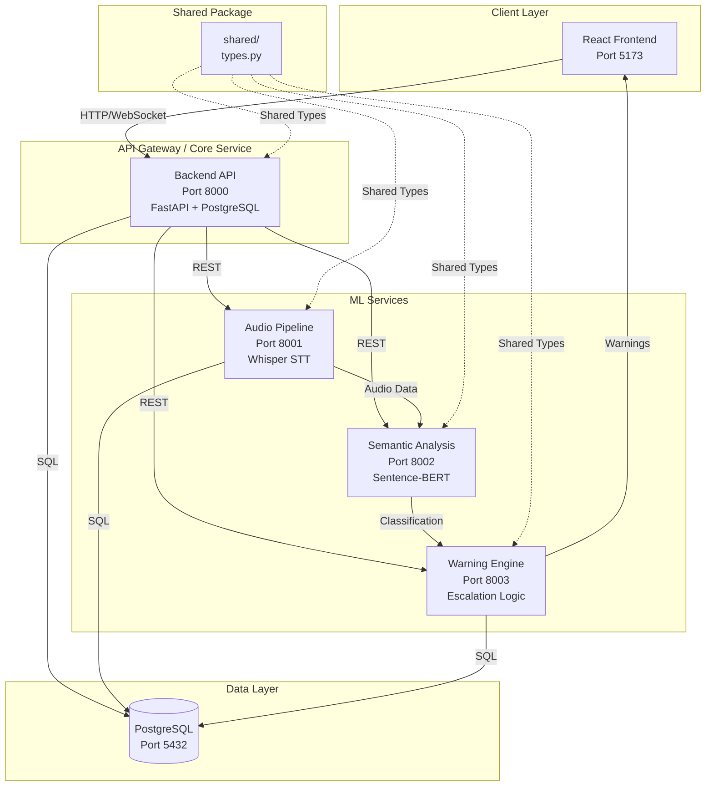
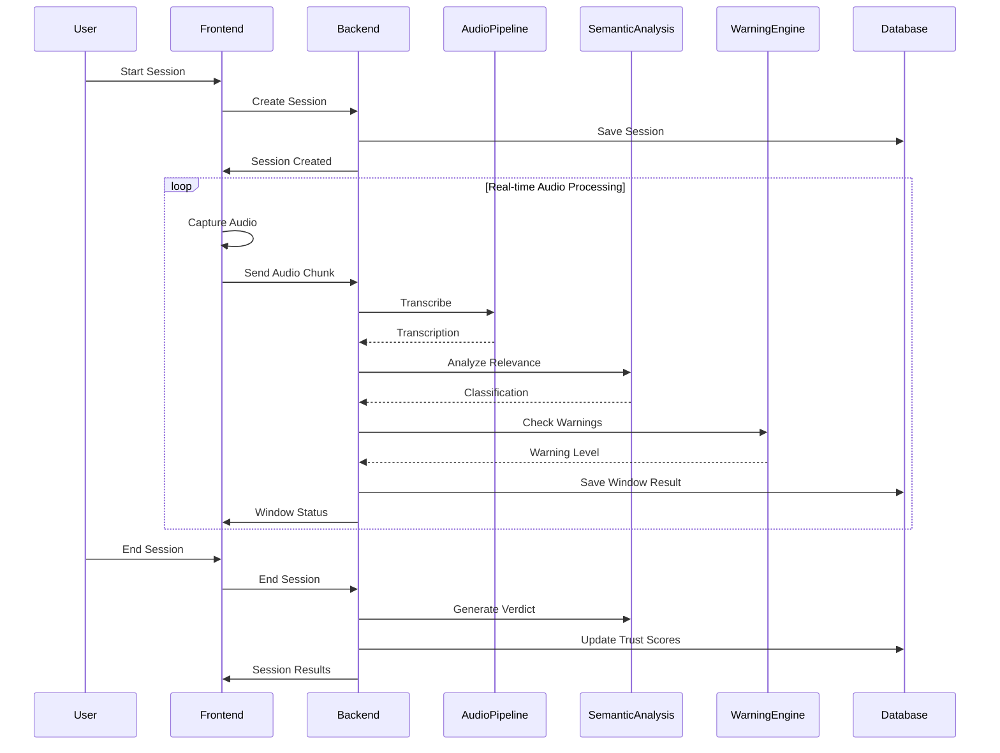
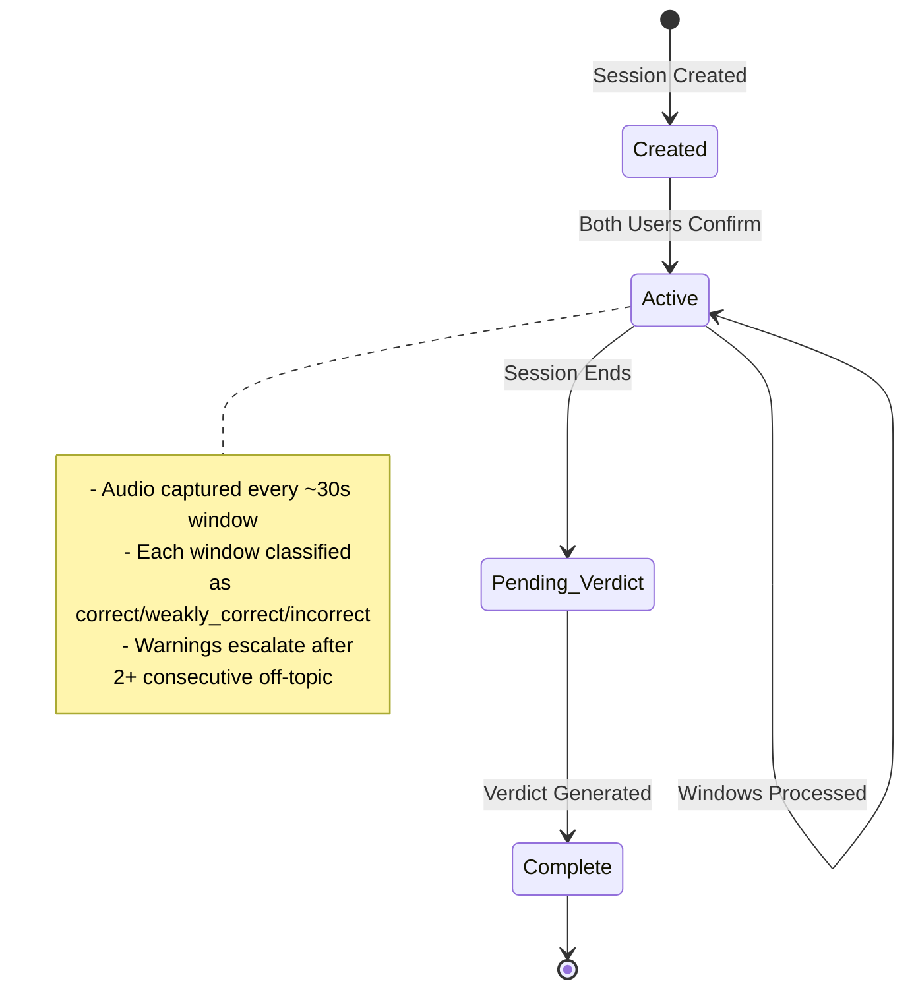
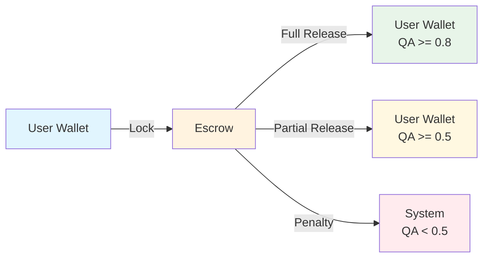

# Core Barter System Architecture

## Overview

The Core Barter System is a real-time audio conversation monitoring platform that enforces topic adherence during barter/negotiation sessions. It uses a microservices architecture with four FastAPI services and a React frontend.

## System Architecture Diagram

## Service Details

### 1. Frontend (React SPA - Port 5173)
- **Technology**: React 18+, Vite, MediaRecorder API
- **Purpose**: User interface for session management
- **Key Screens**:
  - Setup screen for session configuration
  - Live session screen with real-time audio capture
  - Post-session screen with verdict and trust scores

### 2. Backend API (FastAPI - Port 8000)
- **Technology**: FastAPI, SQLAlchemy, PostgreSQL
- **Purpose**: Core business logic and orchestration
- **Components**:
  - `main.py` - FastAPI application entry point
  - `routes.py` - REST API endpoints
  - `models.py` - SQLAlchemy database models
  - `schemas.py` - Pydantic validation schemas
  - `websocket.py` - Real-time communication
  - `escrow.py` - Escrow management logic
  - `safety.py` - Safety and validation utilities

### 3. Audio Pipeline (FastAPI - Port 8001)
- **Technology**: FastAPI, OpenAI Whisper, FFmpeg, PyTorch
- **Purpose**: Audio transcription service
- **Responsibilities**:
  - Receive audio chunks from frontend
  - Transcribe audio using Whisper model
  - Return text transcriptions to backend

### 4. Semantic Analysis (FastAPI - Port 8002)
- **Technology**: FastAPI, Sentence-BERT (sentence-transformers)
- **Purpose**: Semantic similarity analysis
- **Responsibilities**:
  - Compute cosine similarity between transcript and topic
  - Classify windows as `correct`, `weakly_correct`, or `incorrect`
  - Use configurable thresholds (UPPER=0.55, LOWER=0.35)

### 5. Warning Engine (FastAPI - Port 8003)
- **Technology**: FastAPI, PostgreSQL
- **Purpose**: Warning escalation and session termination
- **Responsibilities**:
  - Track consecutive off-topic windows
  - Issue escalating warnings:
    - 1 window: Silent warning
    - 2 windows: Strong warning
    - 3+ windows: Severe warning + auto-terminate
  - Log warnings to database

### 6. PostgreSQL Database (Port 5432)
- **Technology**: PostgreSQL 16
- **Tables**:
  - `users` - User accounts
  - `barter_sessions` - Session records
  - `session_contracts` - Session agreements
  - `window_results` - Per-window classifications
  - `warnings_log` - Warning history
  - `verdicts` - Session verdicts
  - `confirmations` - User confirmations
  - `wallets` - User wallets
  - `escrows` - Escrow records
  - `credit_transactions` - Transaction history

## Data Flow

## Session Lifecycle

## Escrow System Flow

## Technology Stack Summary

| Component | Technology | Purpose |
|-----------|------------|---------|
| Frontend | React 18+, Vite | User interface |
| Backend | FastAPI, Python | Core API |
| Database | PostgreSQL | Data persistence |
| Audio STT | OpenAI Whisper | Speech-to-text |
| Semantic Analysis | Sentence-BERT | Topic relevance |
| ML Runtime | PyTorch | Model inference |
| Audio Processing | FFmpeg | Audio format handling |
| Real-time | WebSocket | Live updates |
| Container | Docker | Service deployment |

## Inter-Service Communication

- **Frontend → Backend**: HTTP REST + WebSocket
- **Backend → ML Services**: REST API calls
- **All Services → Database**: SQL via SQLAlchemy
- **Shared Types**: Python package import from `packages/shared/`