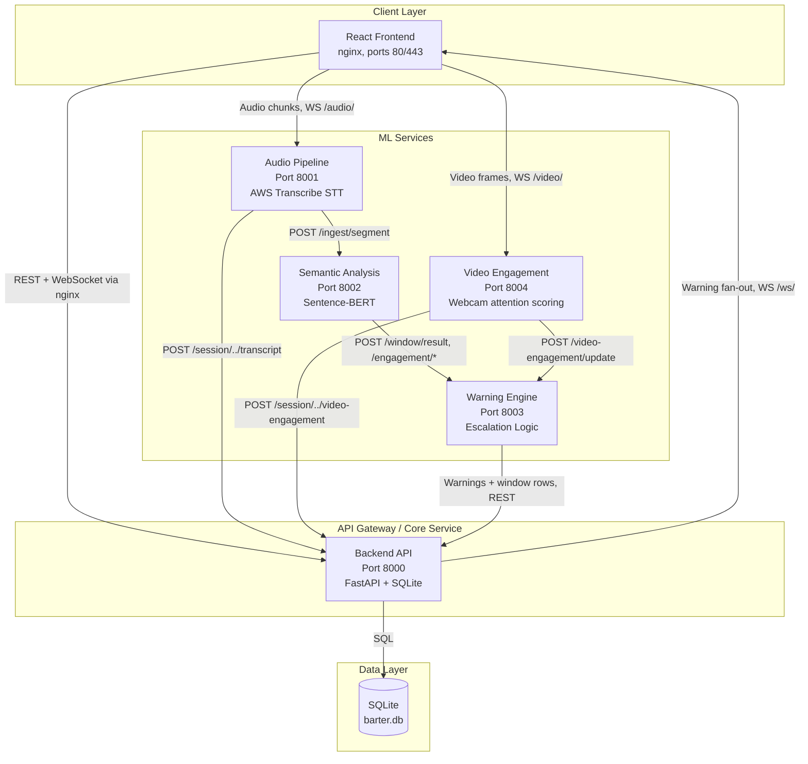
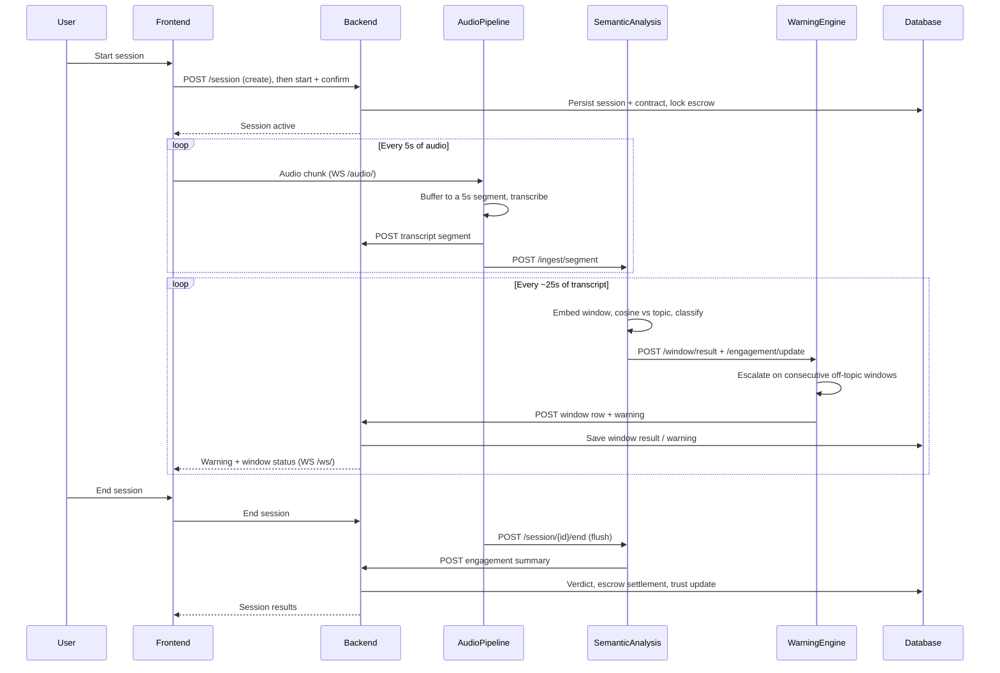
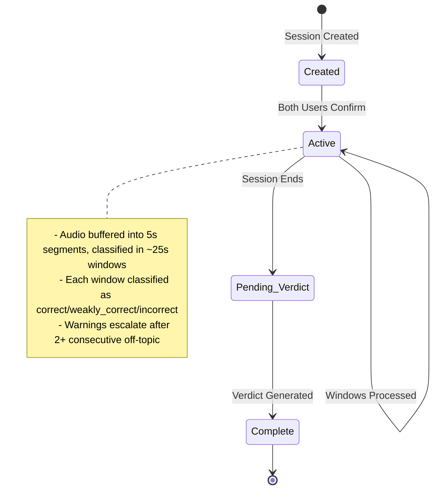
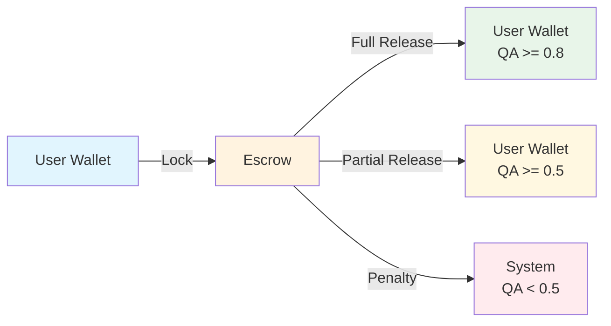

# Core Barter System Architecture

## Overview

The Core Barter System is a real-time audio and video conversation monitoring platform that enforces
topic adherence during barter/negotiation sessions. It uses a microservices architecture with five
FastAPI services and a React (nginx-served) frontend, backed by SQLite.

The services form a pipeline rather than a hub-and-spoke: the browser streams audio and video
straight to `audio_pipeline` and `video_engagement` through the nginx proxy, each stage calls the
next directly, and only `warning_engine` and the capture services write evidence back to `backend`.

## System Architecture Diagram

## Service Details

### 1. Frontend (React SPA — nginx 80/443 in Docker, Vite dev server 5173 locally)
- **Technology**: React 18+, Vite, MediaRecorder API
- **Purpose**: User interface for session management
- **Key Screens**:
  - Setup screen for session configuration
  - Live session screen with real-time audio capture
  - Post-session screen with verdict and trust scores

### 2. Backend API (FastAPI - Port 8000)
- **Technology**: FastAPI, SQLAlchemy, SQLite (async, via aiosqlite)
- **Purpose**: Core business logic and orchestration
- **Components**:
  - `main.py` - FastAPI application entry point
  - `routes.py` - REST API endpoints
  - `models.py` - SQLAlchemy database models
  - `schemas.py` - Pydantic validation schemas
  - `websocket.py` - Real-time communication
  - `escrow.py` - Escrow management logic
  - `safety.py` - Safety and validation utilities

### 3. Audio Pipeline (FastAPI - Port 8001)
- **Technology**: FastAPI, FFmpeg
- **STT backend**: AWS Transcribe by default (`STT_BACKEND=aws`); other backends (e.g. local/Whisper, Deepgram) may be configured per deployment — see [`CLAUDE.md`](../CLAUDE.md)
- **Purpose**: Audio transcription service
- **Responsibilities**:
  - Receive audio chunks from the frontend over WebSocket (nginx `/audio/`), buffered into 5-second
    segments (`BUFFER_THRESHOLD_SECONDS`)
  - Transcribe each segment via the configured STT backend
  - POST the transcript segment to `semantic_analysis` `/ingest/segment`, and to the backend for storage
  - POST toxicity findings to `warning_engine` `/safety/alert`

### 4. Semantic Analysis (FastAPI - Port 8002)
- **Technology**: FastAPI, Sentence-BERT (sentence-transformers)
- **Purpose**: Semantic similarity analysis
- **Responsibilities**:
  - Accumulate 5-second transcript segments until a ~25-second window is full
    (`WINDOW_DURATION_THRESHOLD`)
  - Compute cosine similarity between the window transcript and the session topic
  - Classify the window as `correct`, `weakly_correct`, or `incorrect` using `UPPER = 0.36` /
    `LOWER = 0.14`, or the relative threshold `thr = RHO · R` — see
    [threshold-calibration.md](threshold-calibration.md) for how those numbers were derived
  - POST window results and engagement updates to `warning_engine`

### 5. Warning Engine (FastAPI - Port 8003)
- **Technology**: FastAPI
- **Purpose**: Warning escalation and session termination
- **Responsibilities**:
  - Track consecutive off-topic windows
  - Issue escalating warnings:
    - 1 window: Silent warning
    - 2 windows: Strong warning
    - 3+ windows: Severe warning
  - Fuse the speech engagement score from `semantic_analysis` with the video attention score from
    `video_engagement` via a sigmoid-logistic model,
    `sigmoid(FUSION_WEIGHT_SPEECH · speech + FUSION_WEIGHT_VIDEO · video + FUSION_BIAS)`, with
    weights fitted by logistic regression rather than fixed by hand — see
    [threshold-calibration.md](threshold-calibration.md)
  - Log warnings and window rows to the backend via REST (no independent database of its own —
    session state is in-process, see [Known Limitations](#known-limitations))

### 6. Video Engagement (FastAPI - Port 8004)
- **Technology**: FastAPI, face-landmark sub-signals (eyes / head pose / gaze)
- **Purpose**: Scores webcam attention per 5-second window per user
- **Responsibilities**:
  - Receive video frames from the frontend over WebSocket (nginx `/video/`)
  - Compute `video_attention_score` from weighted sub-signals
    (`VIDEO_WEIGHT_EYES` 0.55 / `VIDEO_WEIGHT_HEAD` 0.40 / `VIDEO_WEIGHT_GAZE` 0.05)
  - Capture a per-user neutral baseline (`POST /video/{barter_id}/{user_id}/calibrate`) used by
    the head-deviation and gaze sub-signals; attempts are audit-logged to the backend
    (`POST`/`GET /session/{barter_id}/video-engagement/calibration-log`)
  - POST raw results to the backend for storage and to `warning_engine` for fusion
- **Weights and rationale**: [video_engagement/design-choices.md](video_engagement/design-choices.md)

### 7. SQLite Database
- **Technology**: SQLite, accessed via SQLAlchemy async engine (`aiosqlite`)
- **Tables**:
  - `users` - User accounts
  - `barter_sessions` - Session records
  - `session_contracts` - Session agreements
  - `window_results` - Per-window classifications
  - `warnings_log` - Warning history
  - `verdicts` - Session verdicts
  - `confirmations` - User confirmations
  - `wallets` - User wallets
  - `escrows` - Escrow records
  - `credit_transactions` - Transaction history
  - `calibration_logs` - Per-user video calibration attempts (audit)

## Data Flow

## Session Lifecycle

## Escrow System Flow

## Technology Stack Summary

| Component | Technology | Purpose |
|-----------|------------|---------|
| Frontend | React 18+, Vite, nginx | User interface + reverse proxy/SSL termination |
| Backend | FastAPI, Python | Core API |
| Database | SQLite | Data persistence |
| Audio STT | AWS Transcribe (default), FFmpeg | Speech-to-text |
| Video engagement | Face-landmark sub-signals | Webcam attention scoring |
| Semantic Analysis | Sentence-BERT | Topic relevance |
| Real-time | WebSocket | Live updates |
| Container | Docker Compose | Service deployment |

## Inter-Service Communication

- **Frontend → Backend**: HTTP REST + WebSocket, proxied through nginx (see `apps/frontend/nginx.conf`)
- **Frontend → Audio/Video services**: raw media over WebSocket, proxied by nginx (`/audio/`, `/video/`)
- **Service → Service**: REST API calls along the pipeline
  (`audio_pipeline → semantic_analysis → warning_engine`, and `video_engagement → warning_engine`),
  resolved via Docker Compose service DNS
- **All Services → Database**: only the backend talks to SQLite directly; other services report evidence to the backend over REST

## Known Limitations

- Audio buffers, warning counters, and semantic windows live in each service's process memory — restarting a service loses in-flight session state (no persistence/replay of monitoring history).
- No authentication/authorization layer yet: service-only and participant-facing routes are not separated, and identities are supplied by the caller rather than verified.

See [issues.md](issues.md) for the current, actively-tracked list of known bugs and gaps.